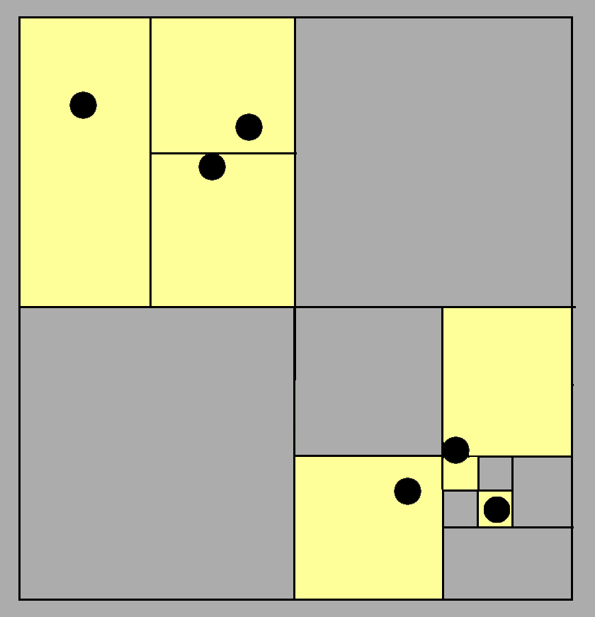
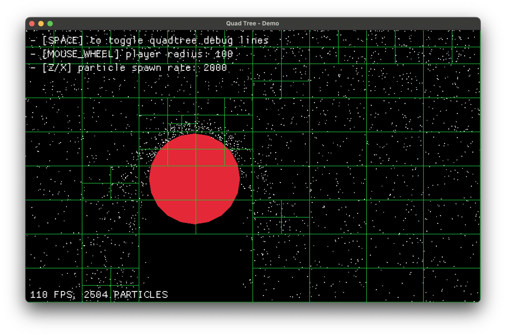

# Spatial partitioning for collision detection

When dealing with many objects on screen: projectiles, particles, characters and more; collision detection can quickly become a bottleneck. Brute-force checks between entities don’t scale. Spatial partitioning can be used as a solution and this brief article covers it via 2D collision detection, its common performance bottlenecks, and how **quadtrees** can make a difference. We'll walk through a real example using **Rust and Macroquad**.

<br>

## Why spatial partitioning?

Naive collision detection checks every object against every other, quickly becoming impractical at scale. By exploiting objects’ position info, we can avoid needless checks and focus only on those close enough to interact.

**Spatial partitioning** organizes objects in space to minimize unnecessary comparisons. By partitioning space cleverly, we reduce the computational effort needed to answer spatial queries efficiently.

> For collision detection, we should only care about objects likely to collide with a given target—why check things that are clearly too far away?

<div style="text-align: center;">
  
</div>

Games, simulations, and physics engines use spatial partitioning for fast "what's near me" lookups, including:

- **Broad-phase collision detection**
- Raycasting acceleration
- Visibility checks
- Frustum culling

Sidenote: I highly recommend Bob Nystrom’s article, which is where I took the above image from: [https://www.gameprogrammingpatterns.com/spatial-partition.html](https://www.gameprogrammingpatterns.com/spatial-partition.html)

<br>

## 2D collision detection

As said before, the naive way is to loop through every pair of objects and check if they collide.

```rust
for i in 0..entities.len() {
    for j in (i+1)..entities.len() {
        check_collision(&entities[i], &entities[j]);
    }
}
```

This works fine when we’re only handling a small number of comparisons per frame. But the moment object count rises, it turns into a frame-killer. 1,000 objects means nearly 500,000 checks every frame.

$$
\begin{aligned}
\text{Total comparisons} &= \frac{N(N + 1)}{2} \\
                         &= \frac{1000 \times 1001}{2} \\
                         &= \frac{1001000}{2} \\
                         &= 500500
\end{aligned}
$$

Entity 0 checks against [1, 2, ..., 999], Entity 1 checks against [2, ..., 999], and so on. You’re looking at $ 1000 + 998 + 997 + ... + 1 $ comparisons. That’s the sum of the first N natural numbers, where N is the number of objects—so yeah, we’re dealing with $ O\(n\(n+1\)/2\) $ which becomes $O(n^2)$ for large $n$, the gain is negligible.

The major downside of this approach is that **we have no idea which objects are worth checking**. We could, in theory, compute every possible distance and perform collision detection on the entire set—but that would be wildly inefficient. There has to be a better way to query nearby objects without sacrificing performance this severely. What we want is, at worst, an $ O(\log N ) $ operation that tells us exactly who's nearby.

<br>

## Useful data structures

### Grids

Split the world into uniform, fixed-size cells, like a chessboard covering the entire space. Each object is assigned to the cell(s) it falls into. When querying:

- look only in the object’s cell and its 8 neighbors
- if each cell holds on average k objects, you check at most 9k entries (this would also depend on what kind of bodies you're working with).

**Querying cost**  

$$
T_\text{grid} \approx 9k \quad\implies\quad O(1)\ (\text{if }k\text{ is bounded})
$$

<div style="text-align: center;">
  
</div>

> **NOTE**: Grids are fast and simple, but they don’t scale well when object densities vary a lot. Sparse regions **waste memory**.

<br>

### Quadtree

Quadtrees handle uneven density well by splitting space more where objects cluster and keeping it coarse where no objects are present. They shift the complexity onto the data structure and management, rather than on raw computation effort during queries.

**Querying cost**  

$$
T_\text{quadtree} \approx O(h + m) \approx O(\log N + m)
$$

tree height $ h \approx \log_4 N = O(\log N) $

where $ m $ is the number of reported neighbors (usually small).

<div style="text-align: center;">
  
</div>

<br>

---

## Implementing a quadtree

I've built a simple demo to show you how a quadtree behaves and where it becomes useful. For this demo I've implemented a simple Rust + Macroquad program of a floating circle colliding against a raining set of particle falling at a constant rate and different speeds. Collision resolution is secondary and was implemented in the simplest way possible, thus it simply resolves to the collision direction + some dampening effect given by the objects relative velocities.

<br>

### We'll be creating
- Falling particles
- A circular rigid body following the user cursor
- Collision resolution between particle and circle using a per-frame **quadtree**
- Debug visualization of the quadtree on screen

<video controls autoplay muted preload="none" width="100%" style="margin-top: 1em;">
  <source src="../assets/qt/qt-demo.mp4" type="video/mp4">
</video>

<br>

### Resources

- Installing the Rust toolchain: [https://www.rust-lang.org/learn/get-started](https://www.rust-lang.org/learn/get-started)
- Getting started with **macroquad**
    - [https://macroquad.rs/](https://macroquad.rs/)
    - [https://macroquad.rs/docs/](https://macroquad.rs/docs)
- **NOTE**: All the code I'll reference throughout this overview references the demo implementation you can find [here](https://github.com/rhighs/quadtree-demo)

The heart of this system is the `QuadNode` struct, which simply represents a node in our quadtree:

```rust
struct QuadNode {
    region: Rect,
    points: Vec<(u32, Vec2)>,
    regions: Vec<Box<QuadNode>>,
}
```

Each node contains:
- A rectangular region
- Points within that region
- Child regions as Box types
    - about `Box<T>`: [https://doc.rust-lang.org/book/ch15-01-box.html](https://doc.rust-lang.org/book/ch15-01-box.html)

When working with quadtrees you need to care about:
- Creating regions
- Adding points to a region
- Querying the quadtree

<br>

### Making regions

Very straightforward, code explains it better than words

```rust
impl QuadNode {
    fn new(region: Rect) -> Self {
        Self {
            region,
            points: Vec::new(),
            regions: QuadNode::make_regions(&region),
        }
    }

    fn make_regions(region: &Rect) -> Vec<Box<QuadNode>> {
        let x = region.x;
        let y = region.y;
        let hw = region.w / 2.0;
        let hh = region.h / 2.0;
        vec![
            Box::new(QuadNode::new_empty(Rect::new(x, y, hw, hh))),
            Box::new(QuadNode::new_empty(Rect::new(x + hw, y, hw, hh))),
            Box::new(QuadNode::new_empty(Rect::new(x, y + hh, hw, hh))),
            Box::new(QuadNode::new_empty(Rect::new(x + hw, y + hh, hw, hh))),
        ]
    }
}
```

<br>

### Adding points

Adding a point is easily solved via recursion:
- We must first check if the point is contained within the current region (our recursion base case).
- If the node has no subdivisions and isn't at capacity yet, the point is simply added to the current node's point collection.
    - If adding this point would exceed the `QUADTREE_REGION_LIMIT` capacity, the node splits into four quadrants and distributes all points plus the new one among the children based on their position.
- If the node is already subdivided, the point is passed down to the appropriate child node that contains its coordinates.

For the purpose of this demo we can go on recursively assuming our tree won't be that deep in the worst case scenario, to fix any arising issue we can play with the region limit parameter.

```rust
fn add(&mut self, id: u32, position: &Vec2) {
    if !self.region.contains(position.clone()) {
        return;
    }

    if self.regions.len() == 0 {
        if self.points.len() == QUADTREE_REGION_LIMIT {
            self.split();
            self.add(id, position);
        } else {
            self.points.push((id, position.clone()));
        }

        return;
    }

    for region in &mut self.regions {
        region.add(id, position);
    }
}
```

**NOTE**: The region limit is a critical hyperparameter that creates a tradeoff: setting it higher shifts computation toward collision checks while reducing memory usage, whereas setting it lower moves computation to quadtree structuring which uses more memory but reduces collision checks during operation.

<br>

### Querying

```rust
fn query(&self, query_area: &Rect) -> Vec<(u32, Vec2)> {
    let mut ids = Vec::new();
    for node in &self.regions {
        if node.in_region(query_area) {
            if node.regions.len() > 0 {
                ids.append(&mut node.query(query_area));
            } else {
                ids.append(&mut node.points.clone());
            }
        }
    }
    ids
}
```

<br>

### Quadtree update and collision detection

In the main game loop, we rebuild the quadtree each frame:

```rust
// Clear and rebuild the quadtree each frame
let mut qtree = QuadNode::new(Rect::new(
    0.0,
    0.0,
    WINDOW_WIDTH as f32,
    WINDOW_HEIGHT as f32,
));

// Add all particles to the quadtree
for (i, particle) in particles.iter().enumerate() {
    qtree.add(i as u32, &particle.entity.position);
}
```

<br>

### Collision Detection

I won't get into the details of how this works as it is pretty straightforward and simple enough to fit in about 40 LOC. What we want here is a way to resolve collisions with a given player body. My basic approach was to:

- Query the area the player is currently at (which is naively calculated below)
- Verify the found particles actually overlap
- Apply some sort of collision resolution

In here you'll see collision resolution based the circle surface normal and reflection vector causing a sort of bounce effect.

```rust
let player_rect = Rect::new(
    player.entity.position.x - player.entity.bound.r,
    player.entity.position.y - player.entity.bound.r,
    player.entity.bound.r * 2.0,
    player.entity.bound.r * 2.0,
);

for i in qtree.query(&player_rect).iter().map(|p| p.0) {
    if particles[i as usize]
        .entity
        .bound
        .overlaps(&player.entity.bound)
    {
        let particle = &mut particles[i as usize];
        let particle_pos: Vec2 = particle.entity.bound.point();
        let player_pos: Vec2 = player.entity.bound.point();

        // normal vector for reflection
        let normal = (particle_pos - player_pos).normalize();
        let separation_distance = particle.entity.bound.r + player.entity.bound.r;
        particle.entity.position = player_pos + (normal * separation_distance);

        // get reflection vector using the normal
        // v' = v - 2(v·n)n where n is the normal and v is the velocity
        particle.velocity = (particle.velocity + player_velocity)
            - (normal * (2.0 * particle.velocity.dot(normal)));

        // dampening and min velocity
        particle.velocity = particle.velocity * 0.3;
        if particle.velocity.length() < 100.0 {
            particle.velocity = particle.velocity.normalize() * 100.0;
        }

        // small random variation for a fake natural effect
        {
            let angle_variation: f32 = rand::gen_range(-0.1, 0.1);
            // apply temp rotation matrix
            let cos_theta = angle_variation.cos();
            let sin_theta = angle_variation.sin();
            let vx = particle.velocity.x * cos_theta - particle.velocity.y * sin_theta;
            let vy = particle.velocity.x * sin_theta + particle.velocity.y * cos_theta;
            particle.velocity = Vec2::new(vx, vy);
        }
    }
}
```

You can easily see how we're reducing the number of checks. What we're checking collisions against isn't the whole set of particles anymore: we let the quadtree give us the most relevant set of particles that are very likely to collide with the object of interest!

<br>

### Debug drawing

Just so that we're working with Rust, we'll use traits. A Drawable trait is used throughout the demo so that any drawable thing will expose this function. So just like the player implements it, we can also implement the Drawable trait for a QuadNode. I'll use recursion again here, as it became a habit.

```rust
trait DrawShape {
    fn draw(self: &Self) {}
}

impl DrawShape for QuadNode {
    fn draw(&self) {
        let r = self.region;
        draw_rectangle_lines(r.x, r.y, r.w, r.h, 1.0, GREEN);
        for region in &self.regions {
            region.draw();
        }
    }
}

impl DrawShape for Player {
    fn draw(&self) {
        draw_circle(
            self.entity.position.x,
            self.entity.position.y,
            self.entity.bound.r,
            RED,
        );
    }
}

impl DrawShape for Particle {
    fn draw(&self) {
        draw_circle(
            self.entity.position.x,
            self.entity.position.y,
            self.entity.bound.r,
            WHITE,
        );
    }
}
```

<br>

### Putting it all together 

Now that we have a rough idea of how a quadtree is used, let's dive in and build something cool with it. I won't include the full code here since it's a bit too long, but you can get it [here](https://raw.githubusercontent.com/th3terrorist/quadtree-demo/refs/heads/main/src/main.rs).

<br>

### User controls implementation

The user interaction system allows for real-time modification of simulation parameters:

```rust
// Toggle quadtree visualization
if is_key_pressed(KeyCode::Space) {
    debug_lines = !debug_lines;
}

// Adjust player radius with mouse wheel
let (_, mouse_wheel_y) = mouse_wheel();
if mouse_wheel_y != 0.0 {
    player.entity.bound.r = (player.entity.bound.r + mouse_wheel_y * 5.0)
        .max(30.0)
        .min(300.0);
}
```

<br>

### Visualizing the quadtree structure

To better understand how the quadtree adapts to particle distribution, we can toggle a debug visualization with the space bar:

```rust
impl DrawShape for QuadNode {
    fn draw(&self) {
        let r = self.region;
        draw_rectangle_lines(r.x, r.y, r.w, r.h, 1.0, GREEN);
        for region in &self.regions {
            region.draw();
        }
    }
}

// In the rendering section:
if debug_lines {
    qtree.draw();
}
```

Each quadtree node is outlined in green, showing how space is partitioned dynamically.

**Quadtree visualization example:**

<div style="text-align: center; margin-top: 1em;">
  
</div>

> Green lines reveal how dense areas are subdivided further for efficient collision checks.

<br>

### Tweaking parameters for performance testing

You can tweak a few constants to study the quadtree's behavior:

```rust
const QUADTREE_REGION_LIMIT: usize = 10;   // max points before splitting
const PARTICLE_SPAWN_INTERVAL: f32 = 0.05; // time between particle spawns
const PARTICLE_SPAWN_RATE: f32 = 2000.0;   // particles per second
const PARTICLE_RADIUS: f32 = 1.0;          // particle size in pixels
```

Increasing `QUADTREE_REGION_LIMIT` means fewer splits, but heavier queries. Tuning `PARTICLE_SPAWN_RATE` stresses the system with different entity loads.  
(Dynamically adjusting them via user input would be cleaner, but I left it static.)

<br>

### Displaying FPS

Quick and simple:

```rust
draw_text(
    format!("{} FPS", get_fps()).as_str(),
    WINDOW_WIDTH as f32 - 120.0,
    30.0,
    30.0,
    WHITE,
);
```

## To wrap up

Efficient collision detection comes down to minimizing redundant checks. Spatial partitioning structures shift complexity from runtime computation to structured queries, giving you near-logarithmic lookup times and consistent performance on the right domain. Thanks for reading.
