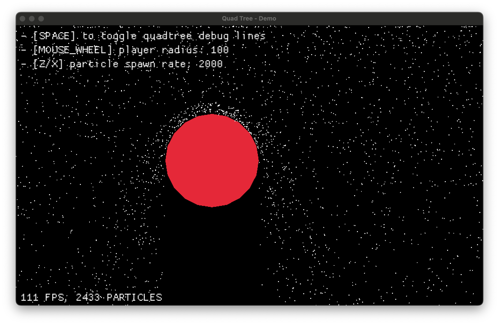

# Spatial partitioning for collision detection

When dealing with many objects on screen: projectiles, particles, characters and more; collision detection can quickly become a bottleneck. Brute-force checks between all entities don’t scale. Spatial partitioning solves that and this article dives into 2D collision detection, the performance problem behind it, and how quadtrees make a difference. We'll walk through a real example using Rust and Macroquad.

## Spatial partitioning

Spatial partitioning breaks space into smaller sections so you don’t have to check every object against every other. It’s about reducing the number of comparisons by partitioning space in a convenient way in order to reduce the computation effort needed to achieve a certain result.

> In the case of collision detection we should only worry about objects that are very likely to collide with a given target, why bother checking anything that is too far away from it? 

Games, simulations, physics engines—anywhere you need fast lookups of "what's near me". That includes:

- Broad-phase collision detection
- Raycasting acceleration
- Visibility checks
- Optimized rendering (e.g., culling)

There are several partitioning methods: uniform grids, quadtrees, BSP trees, octrees, etc. We’ll focus on quadtrees: a recursive 2D structure that splits space into four quadrants. They’re simple, performant, and perfect for dynamic 2D worlds with objects of varying sizes and densities.

<br>

## 2D collision detection

The naive way is to loop through every pair of objects and check if they collide.

```rust
for i in 0..entities.len() {
    for j in (i+1)..entities.len() {
        check_collision(&entities[i], &entities[j]);
    }
}
```

This works fine when we’re only handling a small number of comparisons per frame. But the moment object count ramps up, it turns into a frame-killer. 1,000 objects means nearly 500,000 checks every frame.

$$
\begin{aligned}
\text{Total comparisons} &= \frac{N(N + 1)}{2} \\
                         &= \frac{1000 \times 1001}{2} \\
                         &= \frac{1001000}{2} \\
                         &= 500500
\end{aligned}
$$

Entity 0 checks against [1, 2, ..., 999], Entity 1 checks against [2, ..., 999], and so on. You’re looking at $1000 + 998 + 997 + ... + 1$ comparisons. That’s the sum of the first N natural numbers, where N is the number of objects—so yeah, we’re dealing with $O(n(n+1)/2)$ which becomes $O(n^2)$ for large numbers, the gain is negligible.

The major downside of this approach is that **we have no idea which objects are worth checking**. We could, in theory, compute every possible distance and perform collision detection on the entire set—but that would be wildly inefficient. There has to be a better way to query nearby objects without sacrificing performance this severely. What we want is an O(1) operation that tells us exactly who's nearby.

### Useful data structures

#### Grid approach

You divide the world into fixed-size cells and assign each object to one or more of them. For collision detection, you only check objects within the same or neighboring cells. This method is simple and works well for uniformly distributed objects, but it breaks down when many objects cluster in just a few cells.

#### QuadTree approach

Instead of fixed-size divisions, quadtrees divide recursively. Sparse areas stay shallow. Dense regions subdivide. This keeps the object-per-region count low, and lookups efficient.

- Better adaptability to density
- More complex than grids
- Great for dynamic or hierarchical spaces

## The quadtree implementation

I've built a simple demo to show you how a quadtree behaves and where it becomes useful. For this demo I've implemented a simple Rust + Macroquad program of a floating circle colliding against a raining set of particle falling at a constant rate and different speeds. Collision resolution is secondary and was implemented in the simplest way possible, thus it simply resolves to the collision direction + some dampening effect given by the objects relative velocities.

### We'll be creating
- Falling particles
- A circular rigid body following the user cursor
- Collision resolution between: particle and circle using a constantly updated **quadtree**
- Debug visualization of the quadtree on screen

### Resources

- Installing the Rust toolchain: https://www.rust-lang.org/learn/get-started
- Getting started with **macroquad**
    - https://macroquad.rs/
    - https://macroquad.rs/docs/
- **NOTE**: All the code I'll reference thoughout this overview references the demo implementation you can find [here](https://github.com/rhighs/quadtree-demo)

The heart of this system is the `QuadNode` struct, which simply represents a node in our quadtree:

```rust
struct QuadNode {
    region: Rect,
    points: Vec<(u32, Vec2)>,
    regions: Vec<Box<QuadNode>>,
}
```

Each node contains:
- A rectangular region
- Points within that region
- Child regions as Box types
    - about `Box<T>`: https://doc.rust-lang.org/book/ch15-01-box.html

When working with quadtrees you need to care about:
- Creating regions
- Adding points to a region
- Querying the quadtree

### Making regions

Very straight forward, code explains it better than words

```rust
impl QuadNode {
    fn new(region: Rect) -> Self {
        Self {
            region,
            points: Vec::new(),
            regions: QuadNode::make_regions(&region),
        }
    }

    fn make_regions(region: &Rect) -> Vec<Box<QuadNode>> {
        let x = region.x;
        let y = region.y;
        let hw = region.w / 2.0;
        let hh = region.h / 2.0;
        vec![
            Box::new(QuadNode::new_empty(Rect::new(x, y, hw, hh))),
            Box::new(QuadNode::new_empty(Rect::new(x + hw, y, hw, hh))),
            Box::new(QuadNode::new_empty(Rect::new(x, y + hh, hw, hh))),
            Box::new(QuadNode::new_empty(Rect::new(x + hw, y + hh, hw, hh))),
        ]
    }
}
```

### Adding points

Adding a point is easily solved via recursion:
- We must first check if the point is contained within the current region (our recursion base case).
- If the node has no subdivisions and isn't at capacity yet, the point is simply added to the current node's point collection.
    - If adding this point would exceed the `QUADTREE_REGION_LIMIT` capacity, the node splits into four quadrants and distributes all points plus the new one among the children based on their position.
- If the node is already subdivided, the point is passed down to the appropriate child node that contains its coordinates.
For the purpose of this demo we can go on recursively assuming our tree won't be that deep in the worst case scenario, to fix any arising issue we can play with the region limit parameter.

```rust
fn add(&mut self, id: u32, position: &Vec2) {
    if !self.region.contains(position.clone()) {
        return;
    }

    if self.regions.len() == 0 {
        if self.points.len() == QUADTREE_REGION_LIMIT {
            self.split();
            self.add(id, position);
        } else {
            self.points.push((id, position.clone()));
        }

        return;
    }

    for region in &mut self.regions {
        region.add(id, position);
    }
}
```

**NOTE**: The region limit is a critical hyperparameter that creates a tradeoff: setting it higher shifts computation toward collision checks while reducing memory usage, whereas setting it lower moves computation to quadtree structuring which uses more memory but reduces collision checks during operation.


### Querying

```rust
fn query(&self, query_area: &Rect) -> Vec<(u32, Vec2)> {
    let mut ids = Vec::new();
    for node in &self.regions {
        if node.in_region(query_area) {
            if node.regions.len() > 0 {
                ids.append(&mut node.query(query_area));
            } else {
                ids.append(&mut node.points.clone());
            }
        }
    }
    ids
}
```

### Quadtree update and collision detection

In the main game loop, we rebuild the quadtree each frame:

```rust
// Clear and rebuild the quadtree each frame
let mut qtree = QuadNode::new(Rect::new(
    0.0,
    0.0,
    WINDOW_WIDTH as f32,
    WINDOW_HEIGHT as f32,
));

// Add all particles to the quadtree
for (i, particle) in particles.iter().enumerate() {
    qtree.add(i as u32, &particle.entity.position);
}
```

### Collision Detection

I won't get into the details of how this works as it is pretty straightforward and simple enough to fit in about 40 LOC. What we want here is a way to resolve collisions with a given player body. My basic approach was to:

- Query the area the player is currently at (which is naively calculated as reported below)
- Verify the found particles actually overlap
- Apply some sort of collision resolution

In here you'll see collision resolution based the circle surface normal and reflection vector causing a sort of bounce effect.

```rust
// Define the area to check for collisions
let player_rect = Rect::new(
    player.entity.position.x - player.entity.bound.r,
    player.entity.position.y - player.entity.bound.r,
    player.entity.bound.r * 2.0,
    player.entity.bound.r * 2.0,
);

// Only query particles that could potentially collide
for i in qtree.query(&player_rect).iter().map(|p| p.0) {
    if particles[i as usize]
        .entity
        .bound
        .overlaps(&player.entity.bound)
    {
        let particle = &mut particles[i as usize];
        let particle_pos: Vec2 = particle.entity.bound.point();
        let player_pos: Vec2 = player.entity.bound.point();

        // normal vector for reflection
        let normal = (particle_pos - player_pos).normalize();
        let separation_distance = particle.entity.bound.r + player.entity.bound.r;
        particle.entity.position = player_pos + (normal * separation_distance);

        // get reflection vector using the normal
        // v' = v - 2(v·n)n where n is the normal and v is the velocity
        particle.velocity = (particle.velocity + player_velocity)
            - (normal * (2.0 * particle.velocity.dot(normal)));

        // dampening and minimum velocity
        particle.velocity = particle.velocity * 0.3;
        if particle.velocity.length() < 100.0 {
            particle.velocity = particle.velocity.normalize() * 100.0;
        }

        // small random variation for a fake natural effect
        let angle_variation: f32 = rand::gen_range(-0.1, 0.1);
        // apply rotation matrix
        let cos_theta = angle_variation.cos();
        let sin_theta = angle_variation.sin();
        let vx = particle.velocity.x * cos_theta - particle.velocity.y * sin_theta;
        let vy = particle.velocity.x * sin_theta + particle.velocity.y * cos_theta;
        particle.velocity = Vec2::new(vx, vy);
    }
}
```

You can easily see how we're reducing the number of checks. What we're checking collisions against isn't the whole set of particles anymore: we let the quadtree give us the most relevant set of particles that are very likely to collide with the object of interest!

### Debug drawing

Just so that we're working with Rust, we'll use traits. A Drawable trait is used throughout the demo so that any drawable thing will expose this function. So just like the player implements it, we can also implement the Drawable trait for a QuadNode. Oh and I'll use recursion again just cause it became a habit at this point.

```rust
trait DrawShape {
    fn draw(self: &Self) {}
}

impl DrawShape for QuadNode {
    fn draw(&self) {
        let r = self.region;
        draw_rectangle_lines(r.x, r.y, r.w, r.h, 1.0, GREEN);
        for region in &self.regions {
            region.draw();
        }
    }
}

impl DrawShape for Player {
    fn draw(&self) {
        draw_circle(
            self.entity.position.x,
            self.entity.position.y,
            self.entity.bound.r,
            RED,
        );
    }
}

impl DrawShape for Particle {
    fn draw(&self) {
        draw_circle(
            self.entity.position.x,
            self.entity.position.y,
            self.entity.bound.r,
            WHITE,
        );
    }
}
```

### Putting it all together 

Now that we have a rough idea of how a quadtree is used, let's dive in and build something cool with it. I won't include the full code here since it's a bit too long, but you can check it out and try running it on your own machine:
https://raw.githubusercontent.com/th3terrorist/quadtree-demo/refs/heads/main/src/main.rs

### User controls implementation

The user interaction system allows for real-time modification of simulation parameters:

```rust
// Toggle quadtree visualization
if is_key_pressed(KeyCode::Space) {
    debug_lines = !debug_lines;
}

// Adjust player radius with mouse wheel
let (_, mouse_wheel_y) = mouse_wheel();
if mouse_wheel_y != 0.0 {
    player.entity.bound.r = (player.entity.bound.r + mouse_wheel_y * 5.0)
        .max(30.0)
        .min(300.0);
}
```

### Visualizing the quadtree structure

To help understand how the quadtree adapts to the distribution of particles, we've implemented a visualization system that can be toggled with the space bar:

```rust
impl DrawShape for QuadNode {
    fn draw(&self) {
        let r = self.region;
        draw_rectangle_lines(r.x, r.y, r.w, r.h, 1.0, GREEN);
        for region in &self.regions {
            region.draw();
        }
    }
}

// in the rendering section:
if debug_lines {
    qtree.draw();
}
```

This draws green outlines around each quadtree node, giving us a visual representation of how the space is partitioned.

### Tweaking params for performance testing

You can experiment with these constants to see how they affect performance and behavior:

```rust
const QUADTREE_REGION_LIMIT: usize = 10;   // max points before splitting
const PARTICLE_SPAWN_INTERVAL: f32 = 0.05; // time between particle spawns in seconds
const PARTICLE_SPAWN_RATE: f32 = 2000.0;   // particles to spawn per second
const PARTICLE_RADIUS: f32 = 1.0;          // size of particle in pixels
```

Increasing `QUADTREE_REGION_LIMIT` will result in fewer subdivisions but potentially more collision checks per query. Adjusting `PARTICLE_SPAWN_RATE` lets you test how the quadtree handles different numbers of entities, while watching the FPS counter to monitor performance impact. For a better feedback loop it's much better setting this dinamically via some user input. I was too lazy to do it so I'll leave it up to you.

### Displaying FPS

Very cheap!

```rust
draw_text(
    format!("{} FPS", get_fps()).as_str(),
    WINDOW_WIDTH as f32 - 120.0,
    30.0,
    30.0,
    WHITE,
);
```

Again, the full code is available at: https://raw.githubusercontent.com/th3terrorist/quadtree-demo/refs/heads/main/src/main.rs

## Demo in Action!


### Normal simulation view
<div style="text-align: center;">
  
</div>

> The particle simulation running smoothly without any visible quadtree partitions. All collision detections are efficiently handled under the hood.

### Quadtree debug visualization
<div style="text-align: center;">
  
</div>

> Green lines reveal how the space is partitioned dynamically. Dense regions are subdivided further to maintain high collision detection performance even as thousands of particles are spawned.

### Full demo video
<video controls preload="none" width="100%">
  <source src="../assets/qt/qt-demo-cut.mp4" type="video/mp4">
</video>